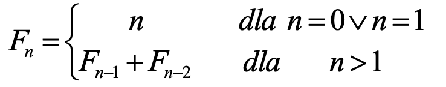

# :white_check_mark: Ciąg Fibbonacciego

## Strona internetowa pozwalająca użytkownikowi na obliczenie podanego przez niego elementu ciągu fibbonacciego.
### Technologia

Projekt został stworzony w:

* Visual Studio Code

Język programowania:

* JavaScript
* HTML
* CSS

#### Wzór obliczający element ciągu:

